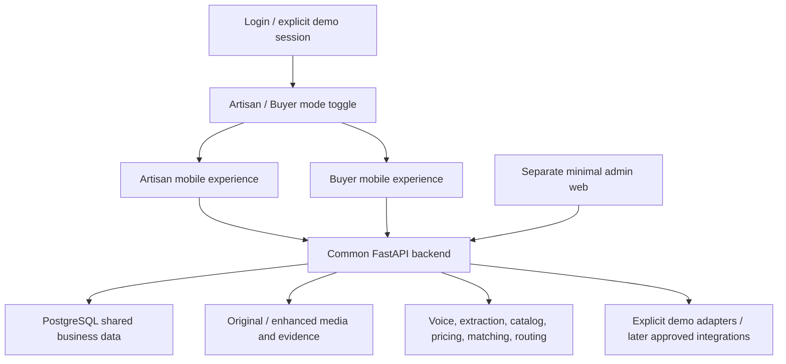

# Updated architecture and complete product flow

Reconciled 2026-09-10 from the original architecture PDF, pasted revisions, final demo clarification, subsequent `1.pdf` lifecycle refinements, and repository inspection. Aakar is the current project name; the original vision calls it CraftConnect. This is the target architecture; see [project context](PROJECT_CONTEXT.md) for what exists today, [source provenance](sources/README.md) for limitations, and [lifecycle update coverage](LIFECYCLE_UPDATE.md) for all 12 new source sections.

## Decisions and scope

One Flutter mobile app supports Artisan and Buyer modes after login. One separate admin web dashboard shares one FastAPI backend, auth identity system, and database. For the hackathon video, switch roles on the same phone/emulator. Do not build Flutter Web for buyers now; later it can reuse Dart code with desktop layout work for procurement, multi-RFQ management, and comparison. There is no need for a separate buyer Next.js frontend.

Core: artisan onboarding and product creation; adaptive cataloging and voice verification; explainable pricing; My Products and separate publishing; internal/external readiness; basic capacity; buyer onboarding/discovery, confirmed requirement structuring, explainable matching, inquiry/customization/capacity, structured negotiation, agreement/orders; optional-per-order sampling and progress checkpoint; routing/packaging/logistics guidance and shipment status; configurable payment milestones; four production steps; buyer inspection and manual issue escalation; simple saved-supplier/history/reorder flow; minimal admin including order issues.

Demo integration: external GeM/ONDC/state-board connection points; milestone payment recording; hub/carrier selection without booking; demo representation request without a real staffing network. Use explicit simulation labels. AI/routing logic and shared workflow state should function even when infrastructure integrations are simulated.

Later: sealed bidding in full, sophisticated trust/safety and automated/advanced disputes, bidding monitoring, live external channel sync, buyer web target, full production ERP. Business insights remain low priority/cuttable; basic admin counts remain in scope. The later PDF makes simple reorder and manual issue handling explicit baseline behavior, superseding their earlier deferral. Optional samples/checkpoints are supported branches, not compulsory for all orders. Preserve deferred requirements below.

Retain the repository's Riverpod, GoRouter, Firebase auth/storage direction, FastAPI, and SQLAlchemy. PostgreSQL/pgvector and Redis/Celery are stack intentions; actual vector search and workers are not complete. Keep one source of business truth; Firestore dependencies do not imply a second independent order database. A backend identity can have role profiles; switching UI mode must not grant unauthorized access. The demo may seed an account with both roles, with role-specific profiles and consistent shared records.

## Full reconciled specification, mapped to the PDF

### 1. Overall architecture — Core

Single mobile app, Artisan Mode, Buyer Mode, separate admin web, common backend, database, AI and APIs. Role selection occurs after authentication. See the mobile-only demo decision above.

### 2. Artisan onboarding and main experience — Core

Open app → select language → onboarding/login → create profile → artisan identity/eligibility verification → Artisan Home. Include local/regional language support as a product goal, voice-first interaction, simple visual UI, artisan profile, verification status, and Help/Voice Assistant. Hindi and English are the current implemented language baseline; label other languages as future until supported. Keep identity verification distinct from verifying a product description. Minimal admin handles pending verification and corrections; do not invent actual eligibility certification.

### 3. Product creation — Core

Add Product → AI-guided photo capture → take photo → image enhancement → speak about product → image + voice understanding → attribute extraction → questions for missing/uncertain information → catalog/description → artisan listens → verifies/corrects by voice → pricing assistant → artisan finalizes price → Save to My Products. **Creation ends here. Publishing is optional and separate.**

### 4. Guided photo capture — Core

Check lighting, framing, angle, product visibility, and image quality. Give actionable guidance such as “Photo thodi dark hai. Product ko light ke paas rakhiye.” Camera guidance should make retaking a photo easy. Distinguish genuine quality checks from demo instructions.

### 5. Image enhancement and studio — Core

Improve lighting, crop/framing, quality, and remove/clean distracting backgrounds. Preserve real colour, texture, shape, design, and craftsmanship; never redesign the item. Retain original and enhanced versions and let the artisan compare and approve.

### 6. Voice-to-catalog — Core

Artisan speaks in the selected language, e.g. “Ye bamboo ka basket hai, maine haath se banaya hai...” Extract product name, category, craft type, material, colour, size/dimensions, usage, craft details/story, and other relevant attributes. Combine image and speech evidence, retain craft vocabulary, and record uncertainty rather than inventing details.

### 7. Adaptive questions — Core

No long mandatory form. Ask only about missing or uncertain information and reuse known values. Example: “Ek mahine mein kitne baskets bana sakte ho?” Confirm uncertain fields instead of silently guessing. Capacity answers can later support publishing and matching; do not make external-channel details mandatory during creation.

### 8. Catalog generation — Core

Generate title, category, structured attributes, professional and craft-aware description, craft/story information, and B2B-friendly specifications. Preserve bilingual output and the original transcript; generated text stays provisional until reviewed.

### 9. Artisan voice verification — Core

This is product-information verification, not KYC. Read generated information in the artisan's language → accept a confirmation or correction → update → obtain final confirmation. Example: AI says a handwoven bamboo basket is 2 feet; artisan corrects it to 1.5 feet. Store the correction and verification status; unconfirmed AI output must not publish.

### 10. Dynamic pricing assistant — Core

Consider material cost, labour and time, overhead from the existing design, craftsmanship, relevant handmade market prices, and comparable products. Show suggested range and “Why this price?”; the PDF example is 420–480. Artisan accepts or edits and sets final price. Recommendations must respect the material + labour + overhead cost floor; use handmade-only comparables and explain conflicts with a low market range. Demo comparable data is not live market research. Do not impose a price or claim fixed demo wage values are statutory rates.

### 11. Save to My Products — Core

Finalized price → saved product → My Products. User-facing states: Draft, Ready to publish, Published, Needs update. Saving must not automatically publish or connect to a channel. Existing backend enums need an explicit mapping/migration; AI review state is distinct from publication state.

### 12. My Products — Core, insights Later

View, edit, re-verify, update, publish, republish, and see status. Basic performance insights remain part of the vision but are lower priority. Proposed: material edits invalidate the affected approval/readiness snapshot; keep the last published version visible until the replacement is approved and explicitly republished.

### 13. Separate publishing and two readiness checks — Core

My Products → select product → Publish → **Internal B2B readiness** → complete required gaps → ready → explicitly publish inside Aakar.

Internal checks cover photos, product details, price, MOQ, available quantity, production capacity, lead time, customization capability, and location. Validate zero stock as a possible made-to-order situation, not automatically “missing”; capacity and timing then determine suitability. A declared “no customization” is a valid answer. Proposed: critical required fields must all pass; show individual gaps rather than an unexplained percentage.

**External channel readiness** is a separate, channel-specific action for GeM, ONDC, or a state board. Existing demo templates include GST registration, HSN, channel-specific descriptions/images/category, and other submission data. Keep separate scores, labels, missing-field prompts, and status per channel. An artisan can accept an internal RFQ without being external-channel ready. These templates are not authoritative eligibility rules. See §41 for demo submission behavior.

### 14. Capacity management — Core, bidding use Later

Maintain current stock, available quantity, weekly/monthly production capacity, average production time, and availability. Supports internal readiness, matching, quotes, and later bidding. Proposed: keep units/time basis explicit, distinguish stock from future production, and account for accepted commitments when confirming capacity. Matching is an estimate; artisan confirmation is required.

### 15. Normal B2B flow — Core with added fulfillment/payment

Buyer posts requirement → AI structures → buyer confirms → smart matching → buyer views/selects artisan → inquiry/RFQ → simplified translated voice/chat → customization → capacity confirmation → draft routing/packaging/delivery costs and optional demo request → structured quotation/negotiation → Sample required? (if yes: sample → buyer approval; if no: continue) → final bulk agreement and payment terms → order → advance milestone confirmed → production → optional progress photo/update and buyer/admin review → ready → packaging checklist/photo → shipping method/label or reference/tracking ID → direct or hub dispatch → in transit → delivered → buyer inspection → required balance settlement → completion → saved supplier/order history → reorder creates a new requirement. An issue at an appropriate stage routes to manual admin review; unresolved blocking issues prevent completion. See §§45–48 for branch details.

Route and costs are estimated before agreement and confirmed before dispatch. Do not surprise either participant with hidden packaging, storage, transport, or demo representation charges after agreement. Any revised commitment needs confirmation.

### 16. Buyer Mode/home — Core subset

Same mobile app after login. Home includes Search/Discover, Post Requirement, My Requirements, Matched Artisans, Inquiries, Quotes, Orders/Order History, Saved Suppliers, Notifications, and Business Profile. Bidding Sessions is roadmap-only and must not appear as an implemented demo action. Basic in-app event updates suffice; scheduled bidding notification infrastructure is excluded.

### 17. Buyer onboarding — Core

Capture business/organization name, business type, industry/category, location, contact details, and relevant verification information. Show verification/trust status. For the demo use simple pending/verified/rejected/correction statuses; do not imply advanced risk scoring exists.

### 18. Buyer discovery — Core, simple

Offer search products, browse artisans, and post requirement. Do not force every buyer through RFQ creation to browse. Seeded data is acceptable when labeled and internally consistent.

### 19. AI requirement posting — Core

Accept typed or spoken request, e.g. “Mujhe 500 handmade bamboo baskets chahiye, 30 days mein.” Structure product, quantity, budget, deadline, customization, location, and other requirements. Buyer reviews/edits/confirms before matching or sending. Unknown budget/location must prompt clarification or remain explicitly unknown, not fabricated.

### 20. Smart artisan matching — Core

Consider craft, product, quantity, MOQ, available stock, production capacity, lead time, price, customization, availability, and location. Explain reasons and gaps; the PDF's “92% Match” is illustrative, not an implemented/calibrated accuracy claim. Proposed: apply hard feasibility constraints before ranking; expose any score's basis and use a deterministic baseline when AI is unavailable. Do not represent partial capacity as full feasibility.

### 21. Product/artisan detail — Core

Product: enhanced images, details, material, craft, price, MOQ, available quantity, capacity, lead time, customization, location. Artisan: profile, craft, verification/trust status, experience, craft story. Only approved published product data is discoverable; demo fixtures must follow the same semantics.

### 22. Artisan comparison — Core, compact mobile version

Compare price, MOQ, capacity, lead time, customization, and verification. Preserve the PDF example: Artisan A price 450, MOQ 50, capacity 500, lead time 20 days; Artisan B price 430, MOQ 100, capacity 300, lead time 15 days. Customization/verification indicators have no reliable text values in extraction; do not invent them. Use a two-artisan comparison or stacked cards on the phone; broader desktop procurement tables are future UX work.

### 23. Inquiry/RFQ — Core

Buyer sends quantity, specifications, deadline, customization, delivery location, and other requirements. Link inquiry to buyer, selected artisan/product, and requirement so that later quotes/orders retain context.

### 24. AI virtual business manager — Core, simplified

Simplify and translate buyer messages into the artisan's local language; convert artisan speech into appropriate buyer-facing business language. Example: buyer requests 500 customized units in 30 days; artisan replies “500 pieces possible hain, 28 din lagenge.” Preserve quantities, dimensions, deadline, price, and intent. Keep originals alongside translated/simplified versions. Proposed: preview outgoing AI-transformed text before sending; translation cannot create acceptance or new terms.

### 25. Structured customization — Core

Capture size, colour, pattern, packaging, logo/branding, and other modifications. Carry these fields through request, quote versions, agreement, and fulfillment checklist.

### 26. Capacity confirmation — Core

Artisan confirms full capacity, partial capacity, or declines. Buyer sees Confirmed, Partial, or Declined. Partial confirmation includes achievable quantity/timing and requires revised agreement; do not silently split across suppliers in the demo.

### 27. Quotation — Core

Include unit price, quantity, MOQ, lead time, customization, delivery, and terms. Buyer accepts, requests change, or rejects. Added terms: packaging responsibility/cost, route and carrier assumption, transport/storage cost where applicable, payment milestones, and optional demo representation arrangement. Proposed: use explicit currency and calculated line-item totals; unknown costs remain estimates needing agreement.

### 28. Negotiation — Core, minimal

Structure quantity, MOQ, unit price, target date, lead time, customization, delivery terms, payment terms, and specifications. Voice/chat remains available; AI converts discussion into reviewable proposed field changes, preserving the original message and requested versus offered terms. Example: “500 bana dungi, lekin 30 din mein nahi, 40 din lagenge” → quantity 500, capacity available, offered lead time 40 days, requested lead time 30 days, Needs negotiation. Do not treat capacity availability as deadline acceptance.

Allow price, quantity, and term changes with quote versions and clear history. Avoid a complicated contract system. Proposed: accept a specific immutable version, invalidate stale acceptance after revisions, and ensure duplicate acceptance does not create duplicate orders. AI extraction never silently overwrites accepted terms.

### 29. Agreement to order — Core with payment protection

After any requested sample is approved (§45), final terms → both parties' confirmation → bulk order. Snapshot agreed quantity, customization, delivery, route/cost responsibility, dates, payment milestones, sample reference if applicable, progress-review agreement, and inspection window. Advance/payment checkpoint occurs before production; see §44. A screen labeled “Agreement” alone provides no payment protection.

### 30. Basic production and physical fulfillment — Core

Keep exactly four production updates: Production started → In progress → Ready → Dispatched. Add one optional production checkpoint with photo/update and buyer/admin review (§46), plus optional quality-check photos and dispatch proof. The checkpoint is a related review record, not extra manufacturing statuses. Do not build manufacturing ERP. The physical layer covers who packages, direct versus hub/CFC routing, who carries the goods, and who handles an on-site demonstration if requested; see §43. Payment, shipment tracking, inspection, and overall order lifecycle states are separate from these four production states.

### 31. Order management — Core

Original artisan labels: New, Confirmed, In Production, Ready, Dispatched, Completed; buyer labels: Pending, Confirmed, In Production, Ready, Dispatched, Completed. Extend the shared order detail/timeline with In Transit, Delivered, and Buyer Inspection, plus visible issue state. Proposed mapping: New/Pending refer to the same initial state; Production started/In progress map to In Production. Keep shipment, payment, inspection, and issues as separate records so one does not falsely imply another. Completion requires delivery, buyer inspection acceptance, settlement of due milestones, and no unresolved blocking issue; “Dispatched” or “Delivered” alone is not “Completed.”

### 32. Saved suppliers/reorder — Core, simple

Order Completed → Saved Supplier → Order History → Reorder. Save artisan/supplier and prefill a new requirement from an earlier order; let the buyer change quantity/specifications and reconfirm current price, capacity, lead time, availability, and customization. Example: a hotel ordered 500 baskets from Meena; six months later Reorder changes quantity to 700 and generates a new requirement. Do not duplicate an accepted order or reuse old approvals/payment records. The later PDF supersedes the earlier cuttable status with this small explicit mechanism.

### 33. Artisan-initiated bidding — Later, excluded in full

Secondary and voluntary, for available stock/capacity, seasonal opportunities, surplus production, or standardized products. Existing product → available quantity → artisan minimum acceptable price → date/time → scheduled session → identify relevant verified buyers → invitations/notifications → sealed offers → session close → artisan review/select buyer(s) → selected offer enters normal quotation/order flow. Demo treatment: one vision slide, “Designed for later: artisan-initiated bidding for surplus stock.” No auction screens/backend/timers needed now.

### 34. Bidding access — Later

No unlimited public participation. Eligible/relevant buyers only, considering verified business, category, product interest, trust/reliability signals, and absence of serious risk flags. Participation may be limited.

### 35. Bidding notifications — Later

T−2 days scheduled notice; T−1 hour reminder; start notification; relevant updates during session; closure at end; result after selection. Preserve these requirements without implementing scheduling infrastructure in the hackathon.

### 36. Sealed bidding — Later

Buyer submits quantity required, price offered, and relevant terms. Offers remain sealed until the session closes; this is not a live price war.

### 37. Artisan selection — Later

Highest price need not win. Artisan considers price, quantity, buyer reliability/trust, and requirement fit. May select one/multiple buyers, split quantity, or reject all.

### 38. Bidding price protection — Later

Artisan controls minimum acceptable price, informed by the pricing assistant's sustainable range. No forced downward pricing. The general cost-floor and artisan-control principles also apply to core quotes.

### 39. Bidding failure cases — Later

No acceptable bids → normal B2B availability. Buyer backs out → next suitable offer or normal B2B. Artisan rejects all → close without order. Multiple suitable buyers → split quantity where appropriate, subject to artisan choice and capacity.

### 40. Business insights — Later/low priority

Lightweight ongoing virtual business manager: product views, buyer interest, inquiries, common buyer requests, basic performance, and actionable suggestions. Preserve examples: “3 buyers asked for more than 100 pieces,” “Your product received 40 views this week,” and “You may want to review your MOQ.” Artisan decides whether to change anything. Do not fabricate real analytics from unrecorded events.

### 41. Marketplace/government connections — Demo integration

Seller: product → AI catalog → standard information → marketplace-ready → supported channel. Where an official API/approved integration exists, future connect/publish/sync may be implemented; otherwise prepare data and provide guided onboarding/submission. Buyer requirements may connect to permitted external sources only when integration/data access exists. Never assume every platform offers an API.

Demo: separate channel-readiness checklist, prepared payload/preview, and explicitly simulated connection status for GeM/ONDC/state board. Do not claim a real submission, approval, eligibility, live marketplace data, or guaranteed buyer response. External rule/provider validation remains future work; no external regulatory research is asserted by this document.

### 42. Admin web — reduced Core, full vision retained

Core: minimal account identification/status, artisan/buyer verification queue (approve, reject, request correction), basic product moderation (flagged listings, AI-output issues, content review), basic counts/analytics, and a minimal manual order-issue queue with context/evidence (§47). Admin may review the optional production checkpoint. Use the same backend/database and a distinct admin permission.

Later/mock: full user-management console; B2B monitoring of requirements/inquiries/quotes/orders/activity; bidding monitoring of scheduled/active/completed/reported/suspicious sessions; trust/safety risk signals, reports, suspicious accounts and restrictions; advanced/automated dispute adjudication beyond basic manual issue intake/review; integration connection/sync/error management; ecosystem analytics covering artisan onboarding, published products, requirements, connections, orders, conversion, and category/region activity. Bidding monitoring is excluded alongside bidding. Basic analytics and manual issue handling must not quietly expand into this whole ops platform.

## Added sections from requested modifications

### 43. Physical fulfillment, storage routing, packaging, logistics, representation

Required addition: explain how a bulk order is packaged, whether it ships direct or through a Common Facility Centre (CFC)/aggregation hub, who transports it (India Post versus consolidated hub-to-buyer logistics as candidate concepts), and who represents the artisan for an on-site demo. Earlier detailed research was not supplied; the design below is **Proposed**, not a recovered provider plan.

Routing inputs: product/material and fragility, quantity, packed dimensions/weight if known, stock versus made-to-order, artisan pickup location, buyer delivery location, deadline, packaging ability, temporary-storage needs, hub capability/availability, and available cost/time estimates. Unknown values must remain visible.

Output: Direct / Via hub / Needs review, with reasons, assumptions, estimated cost/time components, packaging location/responsible party, proposed carrier arrangement, and artisan confirmation. A small explainable rules engine with optional AI language explanation is sufficient; do not pretend it is a trained optimization model.

| Route | Proposed use | Physical handoffs |
|---|---|---|
| Direct | Artisan can package, no consolidation/storage needed, feasible candidate delivery | Artisan packs/QC → carrier handoff → buyer receipt |
| Hub/CFC | Aggregation, packaging help, staging/storage, or consolidated transport is needed and a suitable hub is available | Artisan → hub receipt/count/QC → temporary storage if needed → packaging/consolidation → carrier → buyer |
| Needs review | Hub/carrier feasibility, safe packaging, cost, or timing is unknown | Gather missing facts or revise plan; do not invent booking/availability |

India Post is a candidate for suitable direct shipments; consolidated hub-to-buyer logistics is a candidate for bulk shipment. Neither is a confirmed partnership or automatic best choice. Do not hardcode unsupported volume thresholds, tariffs, service coverage, or hub lists. Demo fixtures can illustrate both routing branches and an insufficient-information case.

Packaging guidance: product-specific protection for fragility/moisture/scratches as relevant, inner protection, separators, outer cartons/crates as appropriate, agreed branding, count/weight/dimensions, labels, quality photos, and dispatch evidence. State who supplies materials, packs, performs QC, and pays. Do not invent certified packaging performance.

Hub/storage plan: proposed facility/location, capability, contact/responsibility, inbound count/condition, storage duration/cost assumption, packing/consolidation responsibility, outbound handoff evidence. If unavailable, show a direct alternative when feasible or Needs review. Do not build warehouse ERP.

Demo representation: buyer requests purpose, location, date, sample/product, and required demonstration. Record artisan availability or a proposed local representative/hub/support person, skills needed, sample transport, travel/service cost, and both parties' confirmation. Status can be Requested / Proposed / Confirmed / Completed or Declined. For the hackathon this is a simulated coordination record, not a staffed field-service operation. Distinguish an on-site product demo request from the hackathon recording itself.

### 44. Payment protection and milestone status

Required addition: agreed payment milestones between agreement and production, at minimum “advance paid / balance due.” **Proposed demo design:** record amount, currency, due event/date, payer/payee, status, confirmation actor/time, optional reference/evidence, and explicit `simulated` or `manual` mode. Suggested statuses: advance due → advance confirmed → balance due → settled; record disputed/unconfirmed evidence without treating it as paid.

Agree any number of needed milestones in the quote, including advance, optional production QC, dispatch, and final delivery/settlement. `1.pdf` supplies a 30/50/20 illustration but explicitly rejects fixed percentages. For its ₹3,00,000 example: ₹90,000 advance received, ₹1,50,000 dispatch milestone pending, ₹60,000 final milestone pending. The review also discusses a 50% production-QC milestone; QC versus dispatch is an agreed trigger, not an interchangeable event. Validate totals and due events without imposing this split.

Gate production on the agreed advance confirmation. Gate final completion on delivery, buyer inspection acceptance, required settlement, and no unresolved blocking issue; balance may be due before dispatch or after delivery according to agreed terms. An order's acceptance and a payment confirmation are different events. A disputed milestone remains visible and routes to manual admin review, not automatic paid status.

No money is moved or held by these demo states. Real milestone payments/escrow, release/refund execution, automated financial dispute decisions, payment provider selection, and operational/legal review remain later integration work. Manual issue reporting is core (§47). Do not call the demo an operating escrow service. Demo advancement may simulate payment, visibly labeled, so the complete flow is recordable without a provider.

## Lifecycle additions from `1.pdf`

### 45. Optional sample approval — Core supported branch

Requirement → matching → inquiry → terms discussion → Sample required? Yes: sample order → buyer approval → bulk order. No: proceed to bulk agreement/order. Especially useful for high-volume/customized orders, but never mandatory for every purchase. Example: hotel requests 500 logo-branded bamboo baskets, requests one sample, artisan makes one, buyer confirms shape/size/logo, then bulk order begins. Sample approval and an on-site demonstration request are distinct.

Proposed minimal record: linked inquiry and sample terms/specification version, quantity, cost/delivery/payment terms if applicable, evidence, buyer decision/time, and correction notes. Requested → In preparation → Sent/Available for review → Approved or Changes requested/Rejected. Sample rejection leaves bulk creation blocked until the buyer approves a corrected sample or both parties explicitly revise/waive the requirement. Approval does not waive the bulk advance. Material specification changes require sample decision reconfirmation. These mechanics make the source's optional approval branch implementable without a sample ERP.

### 46. Optional production checkpoint — Core supported branch

Production started → progress check → photo/update → buyer or admin review → continue production → ready. One lightweight checkpoint for relevant orders; no manufacturing-management system. Example: 250 of 500 baskets completed, recorded as 50%, with a photo so buyer can flag a design mismatch. AI may assist in flagging inconsistencies; never claim “AI guarantees product quality.”

Proposed record: order/specification reference, completed quantity/percentage, photo/update, review actor/result/time, concern notes. If agreed as a payment trigger, link the checkpoint to that milestone; a photo upload alone does not prove acceptance/payment. A flagged problem enters §47; do not silently continue disputed work or release a milestone. Checkpoint timing/hold behavior is agreed per order, not fixed at 50%.

### 47. Flag an Issue and manual admin handling — Core, minimal

Expose issue reporting at appropriate sample/production/shipment/payment/inspection stages. Categories include quality/specification mismatch, inability to fulfill quantity, shipment damage, buyer cancellation, received quantity mismatch, and disputed payment milestone. Admin receives order details, agreed terms, payment status, production status, fulfillment information, and uploaded evidence, and investigates manually. Example: buyer ordered 500, received 470, selects Quantity mismatch and uploads a photo.

Proposed minimal record: reporter/participants, category, description/evidence, related order/milestone/checkpoint, Open / Under review / Resolved status, admin notes and recorded agreed next action. Limit access to participants and authorized admin. Cancellation/shortfall is a flagged exception requiring a recorded decision; do not automatically cancel, refund, pay, penalize, or adjudicate. Preserve unresolved blocking issues and prevent false completion. This small manual queue supersedes the earlier blanket dispute deferral; an automated dispute-resolution engine remains later.

### 48. Buyer inspection and completion — Core

Delivered → Buyer Inspection → Satisfied? Yes: settle remaining required milestones and complete; No: Flag an Issue → manual admin review → recorded outcome and renewed acceptance where needed. Configure/agree the inspection window rather than claiming 48 hours is a universal B2B rule. Physical delivery receipt is not quality acceptance.

Proposed record: delivered timestamp, agreed inspection duration/deadline, acceptance or issue, actor/time, related evidence. Do not auto-accept, auto-settle, or auto-close an issue merely because time elapsed; record any future expiry policy explicitly. Completion requires inspection acceptance, required settlement, and no unresolved blocking issue. After completion, offer the §32 reorder path.

### 49. Concrete dispatch and tracking — Core coordination

Ready → AI-assisted packaging checklist → packaging photo → shipping method → shipping label/reference → tracking ID → Dispatched → In Transit → Delivered. Record who packages and who ships. An artisan-booked courier is an option for smaller orders; a consolidation point supports bulk/multi-artisan cluster shipments when feasible. Retain §43 routing proposals without claiming Aakar operates logistics infrastructure.

Example: fragile ceramic lamps → cushioning added, inner product secured, outer box sealed, package photo uploaded → enter shipping reference or generate a label only through a supported integration. Record tracking ID/reference and carrier; manual updates are acceptable with provenance. 3PL/label generation/live tracking adapters require actual supported access; demo-generated labels are simulated and cannot be presented as carrier-issued. Packaging verification is a recorded checklist/evidence/review, not a guarantee of safe delivery.

### 50. Six-problem framing and final solution

| Problem | Solution and preserved scope |
|---|---|
| Digitalization barrier | Physical product → photo + voice → AI catalog → artisan verification → pricing; professional B2B digitization |
| B2B discovery and capability mismatch | AI-confirmed requirement → matching on craft, product, MOQ, capacity, lead time, price, customization, availability (plus quantity/location from the original plan) |
| Communication and negotiation barrier | AI business manager translates/simplifies formal buyer needs into regional voice/text and artisan replies into structured commercial terms |
| B2B transaction risk | Optional sample, structured agreement/payment terms, advance checkpoint, production, optional progress review, delivery, inspection, manual issues, settlement/completion |
| Fulfillment complexity | Packaging checklist/evidence → shipping reference → tracking → delivery; coordinate the process without operating physical logistics |
| Ecosystem/marketplace fragmentation | Separate internal CraftConnect/Aakar readiness and per-external-channel readiness; automated push remains future absent approved access |

The final architecture joins artisan AI creation/catalog/verification/pricing and buyer requirement understanding/matching/selection through translation/voice and structured negotiation, then sample if needed, agreement/payment, production/progress review, packaging/dispatch/tracking, delivery/inspection, issue-to-admin branch, completion, and reorder. Readiness runs alongside this flow. Bidding remains future/optional, described as **Artisan-initiated Bulk Clearance**, e.g. 80 surplus baskets offered to eligible/pre-verified buyers. Core purpose remains digitization → capable matching → communication support → fulfillment and repeat supplier relationships.

## Proposed shared data and service boundaries

These are design targets, not existing API contracts. Reuse existing Product, image, listing, pricing, and verification records where possible.

| Area | Records / responsibilities to add or extend |
|---|---|
| Identity | Common User identity, role memberships, ArtisanProfile, BuyerProfile, account verification, admin access |
| Catalog | Product publication state, approval versions, attributes/media, InventoryCapacity, separate internal and channel readiness |
| Procurement | Requirement with original input + confirmed structured fields, Match reasons/gaps, Inquiry, original/translated Message, Customization, CapacityConfirmation |
| Commercial | Immutable QuoteVersion with requested/offered terms, Agreement snapshot, optional SampleOrder/Approval, participant-owned Order, SavedSupplier, reorder source/new Requirement, auditable state changes |
| Physical flow | FulfillmentPlan, PackagingChecklist/photo, optional HubPlan and DemoRequest, ProductionCheckpoint/review, shipment method/label/reference/tracking events, delivery receipt, BuyerInspection |
| Money | PaymentMilestone with simulation/manual/provider provenance; later provider event reconciliation |
| Admin | VerificationDecision, ModerationItem, OrderIssue/evidence/manual review/recorded outcome, optional checkpoint review, basic aggregate counts |

Extend `/api/v1` with identity/role, internal readiness/publish, capacity, requirements/matches, inquiries/messages, quote revisions/acceptance, sample decisions, orders, progress reviews, fulfillment/tracking, payment milestones, inspection, issues/manual admin review, saved suppliers/history/reorder, and admin operations as needed. Preserve existing channel endpoints until callers migrate; do not silently reinterpret `/b2b/check-readiness` as internal readiness. Proposed API shapes must be agreed in code before building disconnected screens.

Server rules: authenticated role/ownership/participant checks; no buyer access to another buyer's private RFQ/quotes; no role-toggle privilege escalation; review before publication; record accepted quote version; reject stale/duplicate/conflicting transitions; preserve original messages; isolate demo auth/fixtures from real users. Use shared persisted state for the demo so switching roles does not reset the transaction.

## Open decisions that do not block context setup

- Recover the missing earlier B2B research before claiming exact hubs, partners, logistics costs, or staffing arrangements.
- Choose the minimal admin web framework when implementation starts; none is currently present.
- Define routing thresholds from evidence or clearly marked fixtures, match weighting, and internal-readiness field validation.
- Select real provider integrations and verify their current requirements only when implementing them.
- Decide payment amounts/due events per agreed demo order; real escrow/provider and release/refund policies remain future work.
- Agree per-order sample terms/waiver, optional progress trigger/hold behavior, and inspection duration. The illustrative 30/50/20 split, 50% progress point, and suggested 48-hour window are not universal defaults.
- Extend regional languages only with working input/output support; do not claim it from selectable labels alone.
